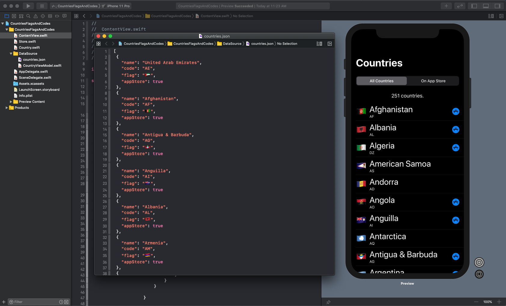

# Countries Flags And Codes
Countries, flags and country code with boolean indicating if country is in App Store

A Simple SwiftUI project that reads a JSON file in the bundle to display all countries including the country flag (emoji),  and 2 letter country code.

Also included is a boolean value that indicates whether or not the country is supported by Apple's App Store.

Feel free to clone or download project and use the JSON as needed.

I will continue to maintain this repo and update whenever Apple adds new stores.

**Last revision:** April 23, 2020

